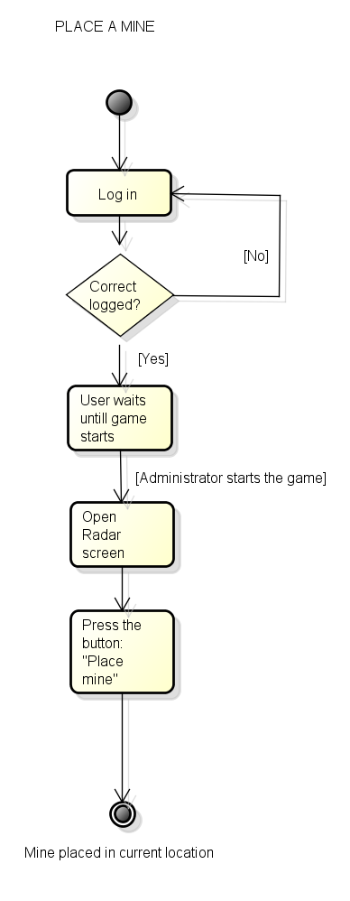

# 1. Cover

# 2. Introduction

# 3. Use Cases
## 3.1 Definition of the user groups
## 3.2 Use case diagrams

## 3.3 Use case scenarios

## Use case scenarios

### Log In
* Actors: Tutor, Student
* Preconditions: 
* Initial state: The user is in the log in screen.
* Normal flow:
  1. The user enters the team name and password.
  2. The user presses the "Log in" button.
  3. If the credentials are correct, the user is logged in to the system.
  4. For the student, the waiting screen will appear. For the tutor, the tutor screen will appear.
* What can go wrong: 
  + The user forgot/lost the password.
  + The user loses the internet connection.
  + The user receives a phone call.
  + The phone runs out of battery.
* Other activities going on at the same time:
* End state: The user is waiting for the game to start.

### Use case scenario: Start game
* Actors: Tutor
* Preconditions: 
  1. The user is logged in.
* Initial state: The user is in the tutor screen.
* Normal flow:
  1. The tutor presses the "Start game" button.
  2. The game starts.
  3. Every student of the game gets a notification. Now all the students automatically access the homescreen.
* What can go wrong: 
  + The user loses the internet connection.
  + The user receives a phone call.
  + The phone runs out of battery.
* Other activities going on at the same time:
* End state: The game has began.

### Scan QR code
* Actors: Student
* Preconditions: 
  1. The user is logged in.
  2. The game has been started by the tutor.
* Initial state: The user is in the homescreen.
* Normal flow:
  1. The user has found the QR sticker and is ready to scan it.
  2. The user presses the "QR" button and the QR scanner opens.
  3. The user centers the QR code inside the guides shown with the camera.
  4. The QR code is recognized and the QR scanner closes, the user is back to the homescreen.
  5. A verification tick is placed beside the checkpoint that has now been verified.
* What can go wrong: 
  + The QR code is incorrect, the user is scanning an invalid QR code for the selected checkpoint: The QR scanner closes and the checkpoint doesn't get verified.
  + The user loses the internet connection.
  + The user receives a phone call.
  + The phone runs out of battery.
* Other activities going on at the same time:
  + All the team members get the verification tick for the checkpoint.
* End state: The checkpoint has been verified and the team is now able to select the next checkpoint they want to search.

### Select active checkpoint
* Actors: Student
* Preconditions: 
  1. The user is logged in.
  2. The game has been started by the tutor.
* Initial state: The user is in the homescreen.
* Normal flow:
  1. The user taps the checkpoint that the team wants to find.
  2. The checkpoint is now active and the button appears to be pressed.
* What can go wrong: 
  + The user loses the internet connection.
  + The user receives a phone call.
  + The phone runs out of battery.
* Other activities going on at the same time:
  + The active checkpoint is updated and synchronized to all of the team members.
  + Now the active checkpoint cannot be changed until one of the team members successfully scans the QR code.
  + Directions are updated:
    1. Right after the checkpoint is marked as active, the directions to reach it from the actual coordinates are calculated.
    2. These directions are updated and available now under the "Directions" tab.
* End state: The checkpoint is marked as active and now the team can start searching it.

### Use case scenario: Place a mine
* Actors: Student
* Preconditions: 
  1. The user is logged in.
  2. The game has been started by the tutor.
* Initial state: The user is in the home screen.  
* Normal flow:
  1. The user opens the radar screen by pressing the "Radar" tab.
  2. Press the button: "Place Mine".
  3. A mine is placed in the current coordinates of the user.
* What can go wrong: 
  + The user loses the internet connection.
  + The user receives a phone call.
  + The phone runs out of battery.
* Other activities going on at the same time:
  + The mine is updated to the system and now available to every player in the game.
* End state: The mine is successfully placed and shown in the radar.

### Use case scenario: List directions for active checkpoint
* Actors: Student
* Preconditions: 
  1. The user is logged in.
  2. The game has been started by the tutor.
* Initial state: The user is in the home screen.  
* Normal flow:
  1. The user presses the tab "Directions".
  2. The directions to reach the active checkpoint are shown in a list form.
* What can go wrong: 
  + The user loses the internet connection.
  + The user receives a phone call.
  + The phone runs out of battery.
* Other activities going on at the same time:
* End state: The user can see the directions to reach the active checkpoint.

### Use case scenario: See enemies
* Actors: Student
* Preconditions: 
  1. The user is logged in.
  2. The game has been started by the tutor.
* Initial state: The user is in the home screen.  
* Normal flow:
  1. The user opens the radar screen by pressing the "Radar" tab.
  2. The nearby enemies are shown in the radar as red dots.
* What can go wrong: 
  + The user loses the internet connection.
  + The user receives a phone call.
  + The phone runs out of battery.
* Other activities going on at the same time:
* End state: The user is in the radar screen seeing in real time where the enemies are.

## 3.4 Depiction of one use case as a flow chart

# 5. Requirements

# 4. System Arquitecture

# 6. User Interface

	Menu Screen when the game starts

	Menu Screen after 4 minutes 
	

	Directions Screen

	Compass Screen

	Radar Screen

 
# 7. Project management, self reflection
