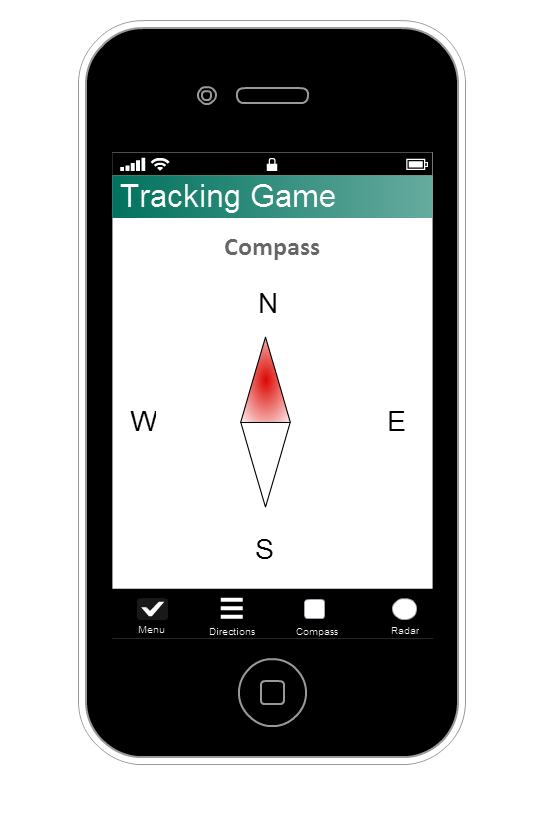
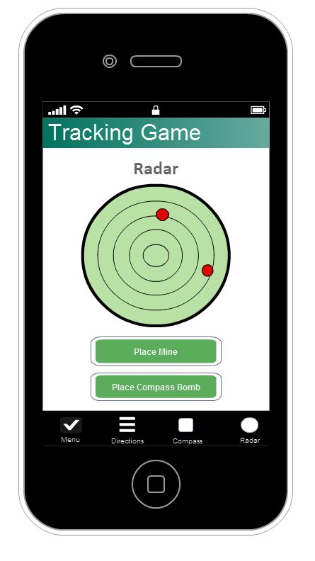

# 1. Cover

##Orientation game: Requirements of the system

| Product Name        | Orientation game         |
|---------------------|--------------------------|
| Team name           | EVAN                     |                         
| Team members        | Eder Jiménez O’Shanahan  |
|                     | Veronika Pepoeva         |
|                     | Alejandro Rueda Pérez    |
|                     | Natalija Kuzova          |
| Date of the report  | 4.12.2013                |
| Editors             | Eder Jiménez O’Shanahan  |
|                     | Veronika Pepoeva         |
|                     | Alejandro Rueda Pérez    | 
|                     | Natalija Kuzova          |

# 2. Introduction

 

Every year there are new students coming to the university and in order to participate in the Metropolia's activities it is important to know the school's facilities: computer rooms, auditoriums, laboratories, libraries, gym, cafeteria etc. The area of the university is rather big and it can be quite complicated for the newcomers to orientate at first. 

We came up with the idea that instead of regular guided tour around the campus during the orientation week we can create an interactive game for the students. This game will not only help to get familiar with the university area but also will demonstrate and advertise the opportunities of today’s media technologies.

The game implemented as a mobile application. The students are divided into groups of 3 to 5 people and their goal is to get through all the checkpoints around the campus first. Each group gets a group name and password from the tutor and by logging under same name and password they get same destinations list. The checkpoint is scored when the QR code is read in the required destination. In order to find the destination application offers the Compass tool and Direction List that appears as soon as the destination is chosen and has list of cardinal directions and distances in meters. At the same time the team can interact with other teams by using Radar tool, which will show if there are other team players around as soon as the tool is opened, but at the same time it will uncover the position of the team. Also the tool allows   placing a mine or a compass bomb that can slow down other teams on their way and to see the same obstacles on their way. 

The main idea to involve all team members of the group is to log in to the same team views from different smart phones and to use different tools (views) at the same time.
In overall the game will create  much more interactive  way to present the university facilities to the new students and demonstrate the technological side of the studying process in Metropolia.

# 3. Use Cases
## 3.1 Definition of the user groups

| User group                 | Brief definition          | Definition                                            |
|----------------------------|---------------------------|-------------------------------------------------------|
| Tutor                      | Manager of the game       | The tutor is able to start the game,                  |
|                            |                           | so that every student (user) could start playing at   |
|                            |                           | the same time. Administrator owns the data with all   |
|                            |                           | the team names and passwords.                         |
| Student                    | Logged in user (Player)   | Student has to log in before starting the game.       |
|                            |                           | Player is using all the features of the game and is   |
|                            |                           | collaborating with his team members.                  |

## 3.2 Use case diagrams

## 3.3 Use case scenarios

## Use case scenarios

### Log In
* Actors: Tutor, Student
* Preconditions: 
* Initial state: The user is in the log in screen.
* Normal flow:
  1. The user enters the team name and password.
  2. The user presses the "Log in" button.
  3. If the credentials are correct, the user is logged in to the system.
  4. For the student, the waiting screen will appear. For the tutor, the tutor screen will appear.
* What can go wrong: 
  + The user forgot/lost the password.
  + The user loses the internet connection.
  + The user receives a phone call.
  + The phone runs out of battery.
* Other activities going on at the same time:
* End state: The user is waiting for the game to start.

### Start game
* Actors: Tutor
* Preconditions: 
  1. The user is logged in.
* Initial state: The user is in the tutor screen.
* Normal flow:
  1. The tutor presses the "Start game" button.
  2. The game starts.
  3. Every student of the game gets a notification. Now all the students automatically access the homescreen.
* What can go wrong: 
  + The user loses the internet connection.
  + The user receives a phone call.
  + The phone runs out of battery.
* Other activities going on at the same time:
* End state: The game has began.

### Scan QR code
* Actors: Student
* Preconditions: 
  1. The user is logged in.
  2. The game has been started by the tutor.
* Initial state: The user is in the homescreen.
* Normal flow:
  1. The user has found the QR sticker and is ready to scan it.
  2. The user presses the "QR" button and the QR scanner opens.
  3. The user centers the QR code inside the guides shown with the camera.
  4. The QR code is recognized and the QR scanner closes, the user is back to the homescreen.
  5. A verification tick is placed beside the checkpoint that has now been verified.
* What can go wrong: 
  + The QR code is incorrect, the user is scanning an invalid QR code for the selected checkpoint: The QR scanner closes and the checkpoint doesn't get verified.
  + The user loses the internet connection.
  + The user receives a phone call.
  + The phone runs out of battery.
* Other activities going on at the same time:
  + All the team members get the verification tick for the checkpoint.
* End state: The checkpoint has been verified and the team is now able to select the next checkpoint they want to search.

### Select active checkpoint
* Actors: Student
* Preconditions: 
  1. The user is logged in.
  2. The game has been started by the tutor.
* Initial state: The user is in the homescreen.
* Normal flow:
  1. The user taps the checkpoint that the team wants to find.
  2. The checkpoint is now active and the button appears to be pressed.
* What can go wrong: 
  + The user loses the internet connection.
  + The user receives a phone call.
  + The phone runs out of battery.
* Other activities going on at the same time:
  + The active checkpoint is updated and synchronized to all of the team members.
  + Now the active checkpoint cannot be changed until one of the team members successfully scans the QR code.
  + Directions are updated:
    1. Right after the checkpoint is marked as active, the directions to reach it from the actual coordinates are calculated.
    2. These directions are updated and available now under the "Directions" tab.
* End state: The checkpoint is marked as active and now the team can start searching it.

### Place a mine
* Actors: Student
* Preconditions: 
  1. The user is logged in.
  2. The game has been started by the tutor.
* Initial state: The user is in the home screen.  
* Normal flow:
  1. The user opens the radar screen by pressing the "Radar" tab.
  2. Press the button: "Place Mine".
  3. A mine is placed in the current coordinates of the user.
* What can go wrong: 
  + The user loses the internet connection.
  + The user receives a phone call.
  + The phone runs out of battery.
* Other activities going on at the same time:
  + The mine is updated to the system and now available to every player in the game.
* End state: The mine is successfully placed and shown in the radar.

### List directions for active checkpoint
* Actors: Student
* Preconditions: 
  1. The user is logged in.
  2. The game has been started by the tutor.
* Initial state: The user is in the home screen.  
* Normal flow:
  1. The user presses the tab "Directions".
  2. The directions to reach the active checkpoint are shown in a list form.
* What can go wrong: 
  + The user loses the internet connection.
  + The user receives a phone call.
  + The phone runs out of battery.
* Other activities going on at the same time:
* End state: The user can see the directions to reach the active checkpoint.

### See enemies
* Actors: Student
* Preconditions: 
  1. The user is logged in.
  2. The game has been started by the tutor.
* Initial state: The user is in the home screen.  
* Normal flow:
  1. The user opens the radar screen by pressing the "Radar" tab.
  2. The nearby enemies are shown in the radar as red dots.
* What can go wrong: 
  + The user loses the internet connection.
  + The user receives a phone call.
  + The phone runs out of battery.
* Other activities going on at the same time:
* End state: The user is in the radar screen seeing in real time where the enemies are.

## 3.4 Depiction of one use case as a flow chart

# 4. System Arquitecture

# 5. Requirements

## 5.1 Functional Requirements

* Student can login as a group member
* Student can start activities only when the game is started by the tutor
* Student can see list of directions only for the chosen point of destination 
* Student gets a point when QR code scanned
* Student is able to see enemies on the radar only if enemies are also in the radar mode
* Student gets extra 5 min to the total time if steps on the mine
* Student is able to place a mine at the current position if not already exist
* Student is able to place a compass bomb at the current position if not already exist
* Student is not able to use the compass if stepped on the compass bomb
* Student reviles his position when in the radar mode
* Position of the student is hidden if not in the radar mode
* Ranking of the teams updates during activation of the view
* The timer stops when all QR codes are scanned

## 5.2 Non-functional system requirements
 
###Usability:

To ensure that the system is easy to use, 
there was made a research while trying to imagine the game only looking at the user interface. After that was decided to remove some buttons.

It was decided to make tabs for easy navigation. Every member of the team will manage with his own tab, 
so it makes the game easier (if every player had to use all the functions of the game by himself at the same time  there would be much mess). Any actions needs no more than 3 clicks.

There are no useless buttons or much unnecessary information. The program is light and easy-to-understand. 

The front page will allow the player to log in. After that it will be possible to choose a
checkpoint and follow the instructions. All the instructions are brief and non-complicated. 
The game requires to be attentive and to be able to use a smartphone.

###Reliability:
              
Before starting the game every player has to log in. If the login or password are not correct the system will ask to log in again. Noone can start playing until the Tutor has started the game. This makes the game honest, so that all the players could start playing at the same time and there was no false start. 

All the information will be stored in the secure place and protected.

Possible system failures can be:
+ Incorrect Username/Password --> log in again

              
###Efficiency: 
             
System has to be able to work with a lot of people at the same time. The most crucial requirement for the system is to update immediately, so that the information about checkpoints, mines and compass bombs was availiable for other players at the same time.
The system is efficient if it is updated within 2 seconds and does not stop other processes of the game.

The game has to work with all the Operating Systems (Android, IOS, Windows, Firefox, etc.)

What other non-functional requirements should be documented?
What kind of metrics you should use to guarantee unambiguity?

# 6. User Interface

### Menu Screen 
	This is how main menu looks. It is divided in 
	two zones: 
	+  The first zone is where the user can see the main checkpoints buttons that is necessary to reach to finish
	the game, the QR button, the time the user has been playing and the Ranking Button.
	  * Checkpoints buttons: pressing those buttons the user selects the checkpoint that 
	  he wants to download the information to the Direction Screen.
	  * QR: This button is needed to be activated when the user finds the checkpoint paper with the QR code in it.
	  * Ranking: This button allows the user to check in which position his group is compared to the other groups.
	+  The second zone is the footer bar menu where the user can change the view of the first zone.
	When a sucessful scan is done, a verification tick will appear next to the active checpoint button.

Menu Screen Just after the Waiting Screen.

Menu Screen after 54 minutes 
	
### Directions Screen
	This is how directions screen looks. There is the footer bar menu as in the Menu Screen and in the main view
	there is a list with the directions and the number of meters to reach each point of the selected checkpoint.
	

Directions Screen

### Compass Screen
	This is how directions screen looks. There is the footer bar menu as in the Menu Screen and in the main view
	there is a compass.

Compass Screen

### Radar Screen
This is how directions screen looks. There is the footer bar menu as in the Menu Screen and in the main view
there is a Radar where appears the enemies, the mines and the bombs. There are also two buttons:
+ The "Place Mine" button: the user place the mine in his current position.
+ The "Place Compass Bomb" button: the user place the mine in his current position.

Radar Screen

 
# 7. Project management, self reflection
