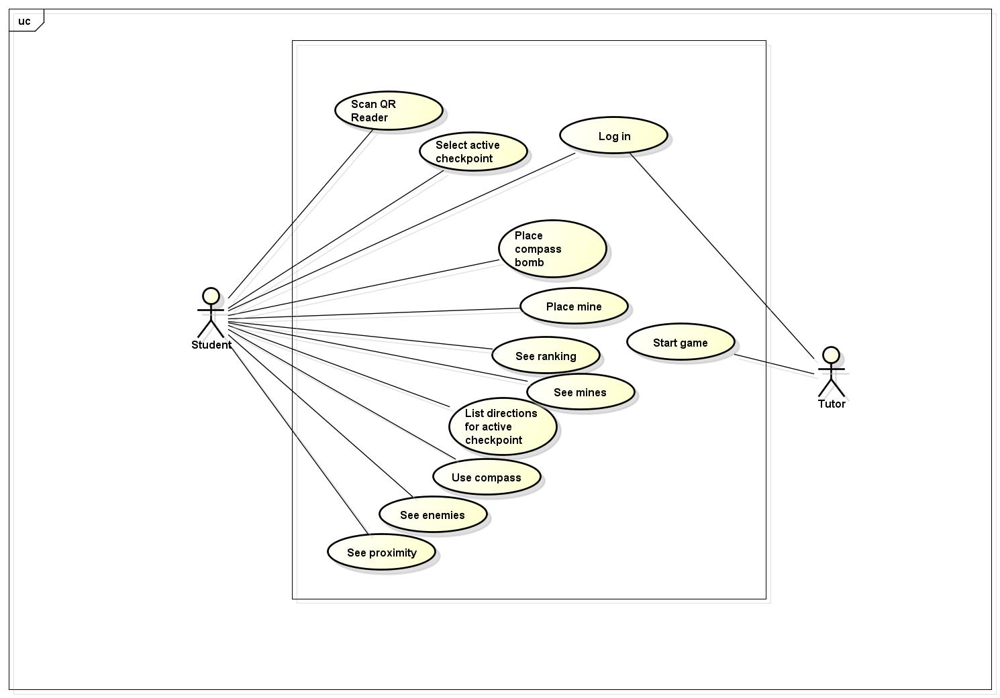

=================================================================================================================
Natalija's space
=================================================================================================================

=================================================================================================================
Veronika's space
=================================================================================================================

=================================================================================================================
Alejandro's space
=================================================================================================================
# 3. Use Cases
## 3.1 Definition of the user groups
## 3.2 Use case diagrams

## 3.3 Use case scenarios

### Place a mine
* Initial state: The user is in the homescreen and the login screen is shown.
* Normal flow:
  1. The user enters his/her team name and the password.
  2. The user waits until the administrator starts the game.
  3. The user gets a notification that the game has started.
  4. Open Radar screen.
  5. Press the button: "Place Mine".
  6. A mine is placed in the current coordinates of the user.
* What can go wrong: 
  + The user loses the internet connection.
  + The user receives a phone call.
  + The phone runs out of battery.
  + The user forgot/lost the password.
* Other activities going on at the same time:
* End state: The mine is successfully placed and shown in the radar.

## 3.4 Depiction of one use case as a flow chart

# 4. System Arquitecture

# 6. User Interface

