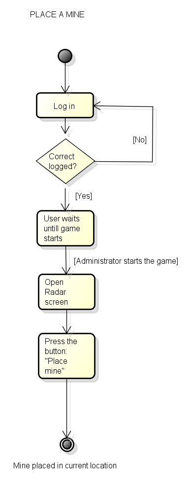

Places to find: classrooms, cafeteria, gym, sports field, helpdesk, megora, 

Actors:
Students
-Homescreen
  -Log In
  -Select active checkpoint
  -Open QR Reader
  -See ranking
  
-Directions screen
  -List directions for active checkpoint

-Compass screen
  -Use Compass
  -See proximity (The screen color changes as you approach the checkpoint)

-Use Radar
  -See enemies
  -See mines
  -Place mine
  -Place compass bomb

Tutors
-Start game

Use case scenario: Place a mine
-Initial state: The user is in the homescreen and the login screen is shown.
-Normal flow:
  1. The user enters his/her team name and the password.
  2. The user waits until the administrator starts the game.
  3. The user gets a notification that the game has started.
  4. Open Radar screen.
  5. Press the button: "Place Mine".
  6. A mine is placed in the current coordinates of the user.
-What can go wrong: 
  -The user loses the internet connection.
  -The user receives a phone call.
  -The phone runs out of battery.
  -The user forgot/lost the password.
-Other activities going on at the same time:
-End state: The mine is successfully placed and shown in the radar.

