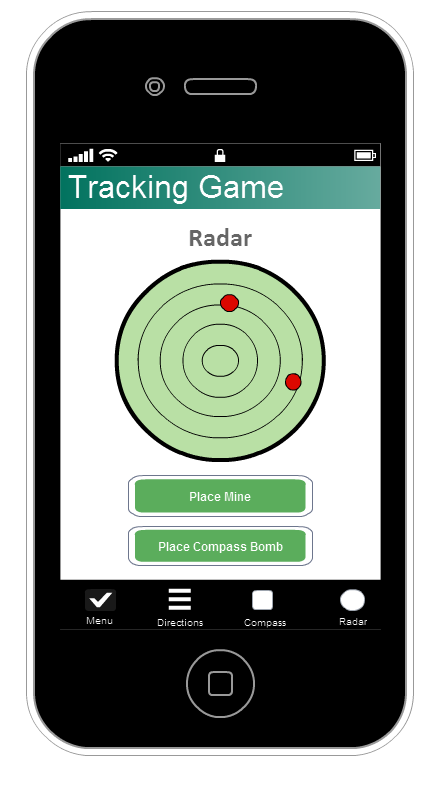
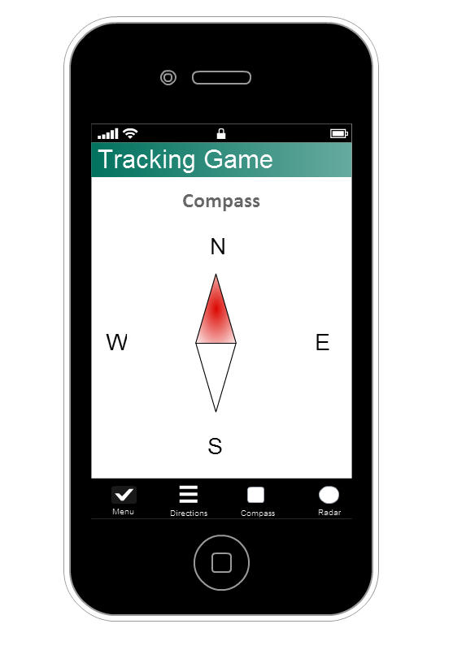
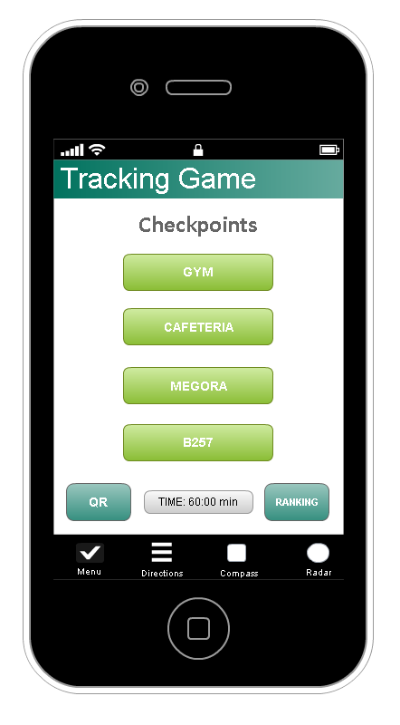
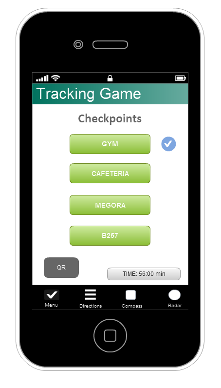

Group members
Natalija Kuzova
Veronika Pepoeva
Alejandro Rueda Perez
Eder Jimenez O'Shanahan

## A. Use cases scenarios and flow chart
### Use cases list

#### Students

  + Log In
  + Select active checkpoint
  + Open QR Reader
  + See ranking
  + List directions for active checkpoint
  + Use Compass
  + See proximity (The screen color changes as you approach the checkpoint)
  + See enemies
  + See mines
  + Place mine
  + Place compass bomb

#### Tutors
* Start game

### Use case scenario: Place a mine

* Initial state: The user is in the homescreen and the login screen is shown.
* Normal flow:
  1. The user enters his/her team name and the password.
  2. The user waits until the administrator starts the game.
  3. The user gets a notification that the game has started.
  4. Open Radar screen.
  5. Press the button: "Place Mine".
  6. A mine is placed in the current coordinates of the user.
* What can go wrong: 
  + The user loses the internet connection.
  + The user receives a phone call.
  + The phone runs out of battery.
  + The user forgot/lost the password.
* Other activities going on at the same time:
* End state: The mine is successfully placed and shown in the radar.

### Flowchart

## B. User interface
### Main Views:
  * Log in: A login screen to log in to the game.
    + Team name and password fields.
    + Login button
  * Homescreen: A list of the checkpoints.
    + Buttons for each checkpoint.
    + Button beside each checkpoint for opening the QR scanner.
    + Check sign beside each checkpoint in case the checkpoint was accomplished.
    + A timer showing the elapsed time.
    + Button for showing the ranking
  * Ranking: Shows the other team's progress in a sorted list.
    + Shows the team name and the amount of accomplished checkpoints.
  * QR Scanner: Scans the QR code for the checkpoint.
    + Camera view with bounds to fit the QR Code.
  * Directions: Shows the directions to get to the active checkpoint.
    + The name of the destination (active checkpoint).
    + Ordered list of cardinal directions and the amount of steps for each one.
  * Compass: Shows the compass.
    + The cardinal directions.
    + The compass arrow.
  * Radar
    + A radar showing the nearby enemies and mines.
    + Place mine button.
    + Place compass bomb button.  
  
 
 
 
 
 

