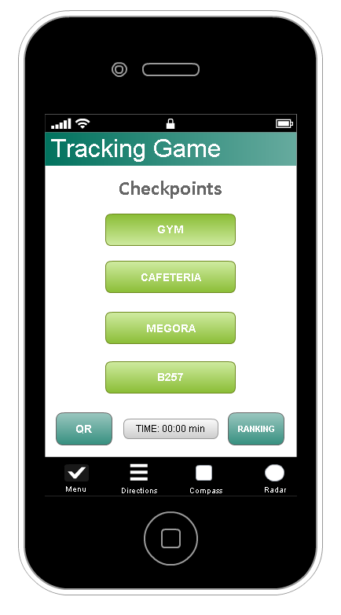
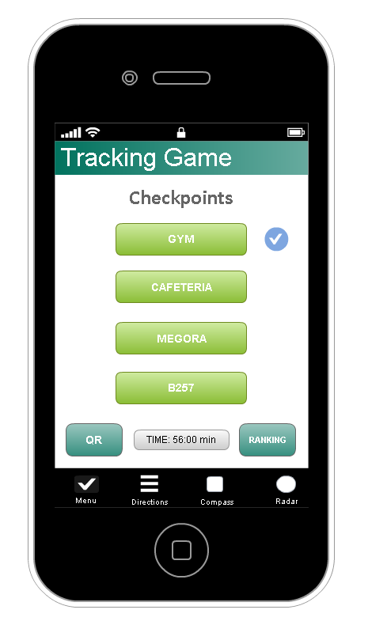
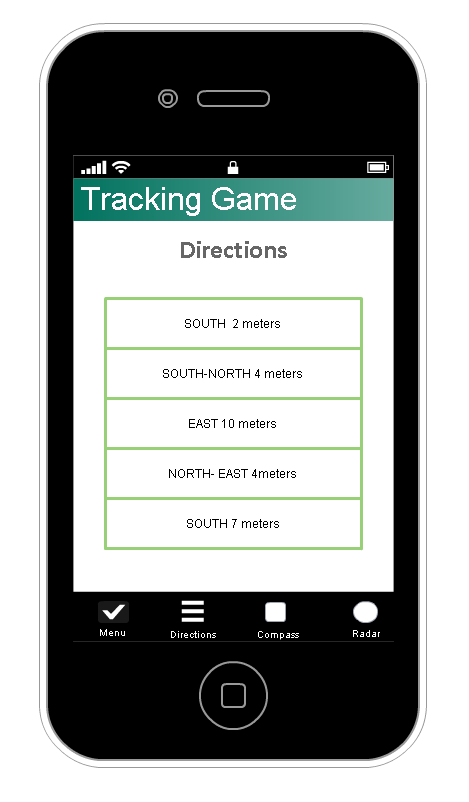

=================================================================================================================
Natalija's space
=================================================================================================================

=================================================================================================================
Veronika's space
=================================================================================================================

=================================================================================================================
Alejandro's space
=================================================================================================================
# 3. Use Cases
## 3.1 Definition of the user groups
## 3.2 Use case diagrams

## 3.3 Use case scenarios

### Place a mine
* Initial state: The user is in the homescreen and the login screen is shown.
* Normal flow:
  1. The user enters his/her team name and the password.
  2. The user waits until the administrator starts the game.
  3. The user gets a notification that the game has started.
  4. Open Radar screen.
  5. Press the button: "Place Mine".
  6. A mine is placed in the current coordinates of the user.
* What can go wrong: 
  + The user loses the internet connection.
  + The user receives a phone call.
  + The phone runs out of battery.
  + The user forgot/lost the password.
* Other activities going on at the same time:
* End state: The mine is successfully placed and shown in the radar.

## 3.4 Depiction of one use case as a flow chart

# 4. System Arquitecture

# 6. User Interface

### Menu Screen 
	This is how main menu looks. It is divided in 
	two zones: 
	+  The first zone is where the user can see the main checkpoints buttons that is necessary to reach to finish
	the game, the QR button, the time the user has been playing and the Ranking Button.
	  * Checkpoints buttons: pressing those buttons the user selects the checkpoint that 
	  he wants to download the information to the Direction Screen.
	  * QR: This button is needed to be activated when the user finds the checkpoint paper with the QR code in it.
	  * Ranking: This button allows the user to check in which position his group is compared to the other groups.
	+  The second zone is the footer bar menu where the user can change the view of the first zone.
	When a sucessful scan is done, a verification tick will appear next to the active checpoint button.

Menu Screen Just after the Waiting Screen.

Menu Screen after 54 minutes 
	
### Directions Screen
	This is how directions screen looks. There is the footer bar menu as in the Menu Screen and in the main view
	there is a list with the directions and the number of meters to reach each point of the selected checkpoint.
	

Directions Screen

### Compass Screen
	This is how directions screen looks. There is the footer bar menu as in the Menu Screen and in the main view
	there is a compass.

Compass Screen

### Radar Screen
	This is how directions screen looks. There is the footer bar menu as in the Menu Screen and in the main view
	there is a Radar where appears the enemies, the mines and the bombs. There are also two buttons:
	  + The "Place Mine" button: the user place the mine in his current position.
	  + The "Place Compass Bomb" button: the user place the mine in his current position.

Radar Screen

